# JVM

## Ch01-JVM与Java体系结构

### 1.Java与jvm简介

#### 1.1 Java：跨平台的语言 

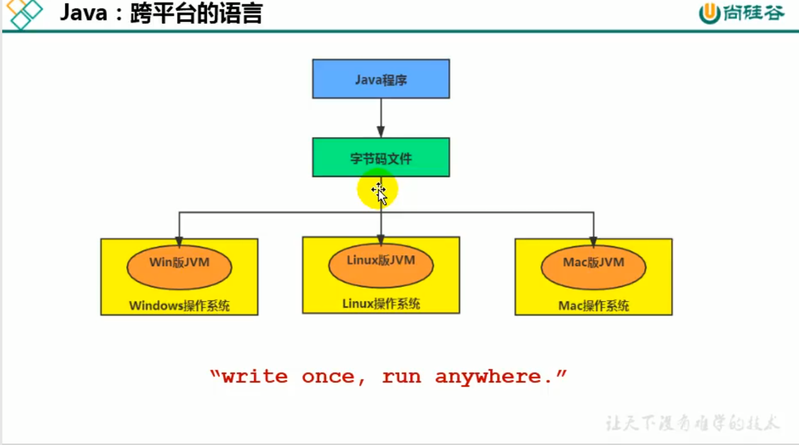

#### 1.2 JVM:跨语言的平台

JVM是一个抽象的计算机，包含自身的指令集、并且在运行时操作内存。

Java虚拟机并不关心运行在其中的程序是使用何种语言编写的，仅关注`字节码文件`，只要最终编译得到的字节码文件符合Java虚拟机的要求，就能够被JVM所装载并运行。

`字节码文件`:指令、符号表、已经其它辅助信息

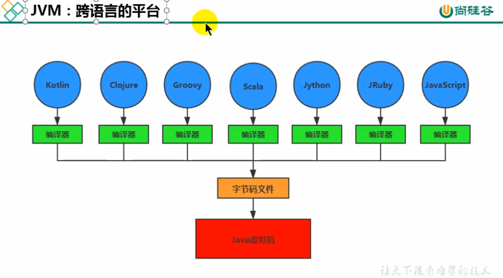

### 2.虚拟机与jvm

**虚拟机**：用于执行一系列虚拟的计算机指令，分为`系统虚拟机`和`程序虚拟机`。

- 系统虚拟机: 如VMWare,完全是对物理计算机的仿真，提供一个可在其上运行操作系统的平台。
- 程序虚拟机:jvm,专门为执行单个计算机程序而设计，在Java虚拟机中执行的指令被称为Java字节码指令

**Java虚拟机**：

- 执行字节码的虚拟计算机，拥有独立的运行机制，字节码文件可由多种语言编译得到
- 运行在操作系统之上，与硬件并不直接交互
- JVM平台上的各种语言可以共享Java虚拟机带来的跨平台性、垃圾回收器、即时编译器
- 将二进制字节码文件装载到其中，解释/编译为对应平台上的机器指令
- 一次编译，到处运行
- 自动内存管理
- 自动垃圾回收

jvm所处位置:

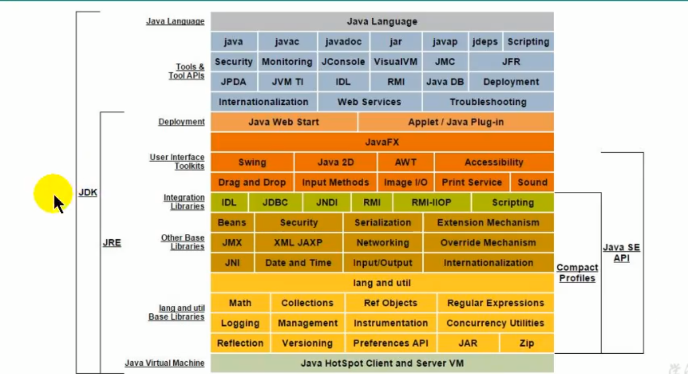

### 3.JVM结构

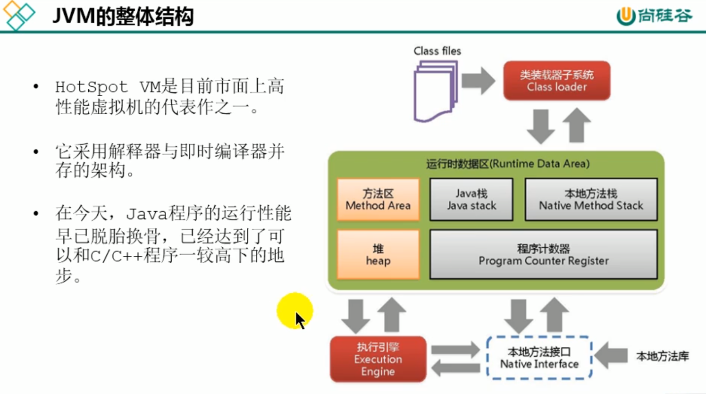

### 4.Java代码执行流程

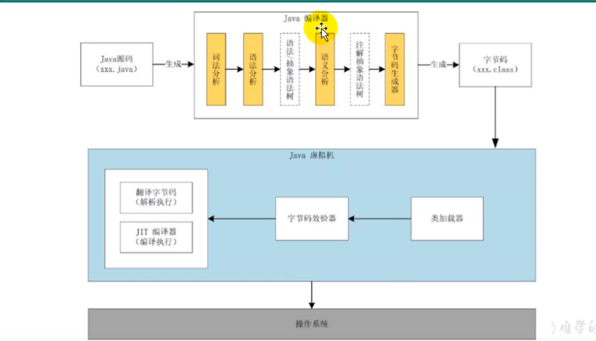

### 5.JVM指令架构

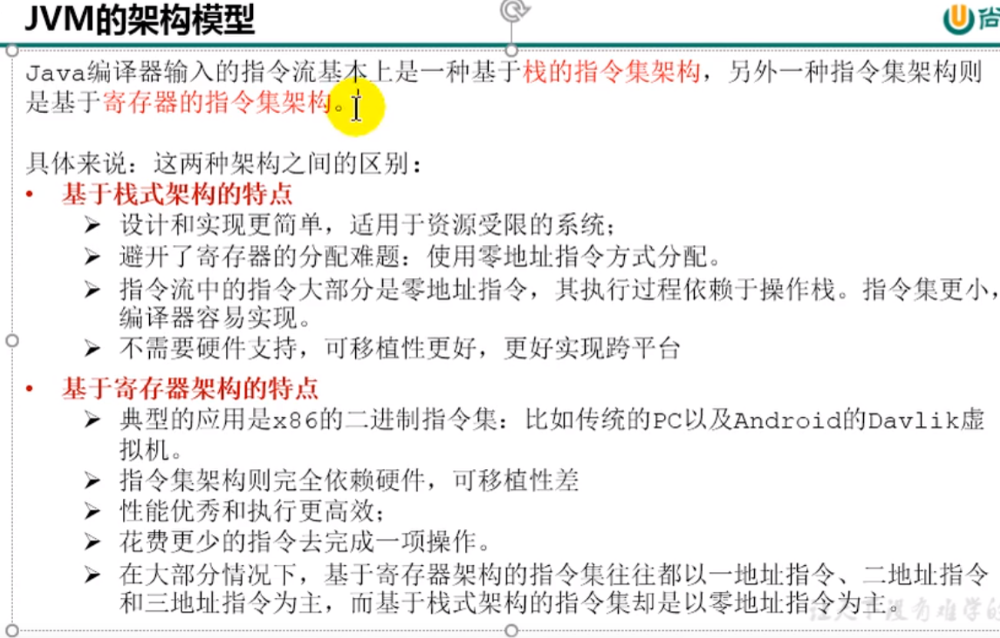

### 6.JVM生命周期

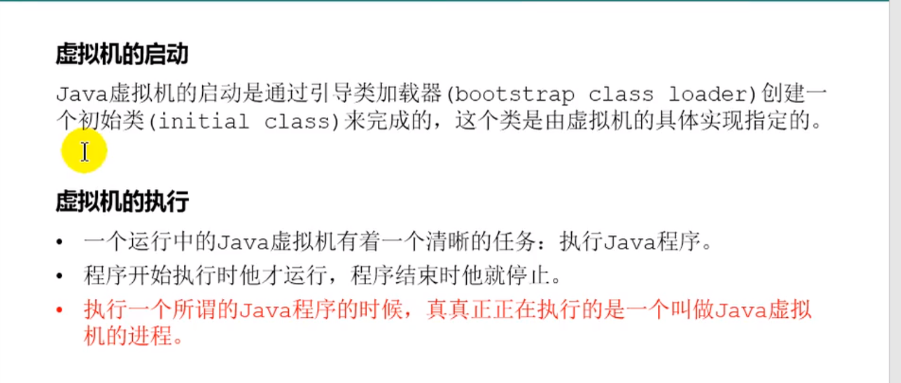

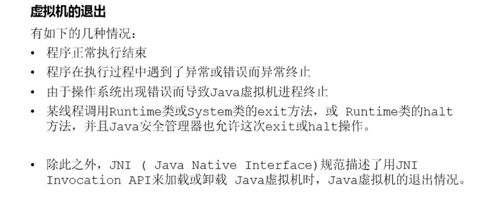

### 7.JVM发展历程

解释器:执行效率低下,逐行翻译执行

编译器:jit 如果发现热点代码，将热点代码编译成机器指令并缓存，以后遇到可以立即执行无需逐行编译

Classic VM

Exact VM:

- Exact Memory Management:准确式内存管理 可以知道内存中某个地址的数据的具体类型
- 编译/解释可混合工作

BEA: JRockit

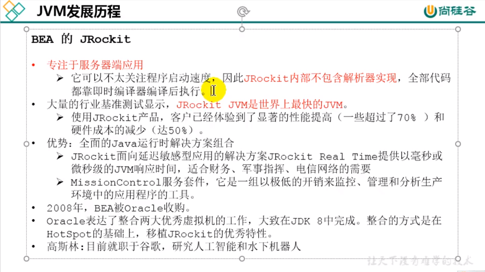

IBM:J9 IBM Technology for Java Virtual Machine ,IT4J 内部代号 J9

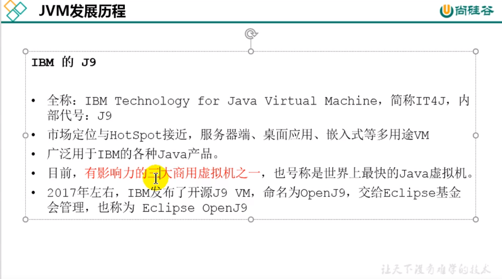

HotSpot VM:

- Oracle JDK /Open JDK 都采用的默认虚拟机

- 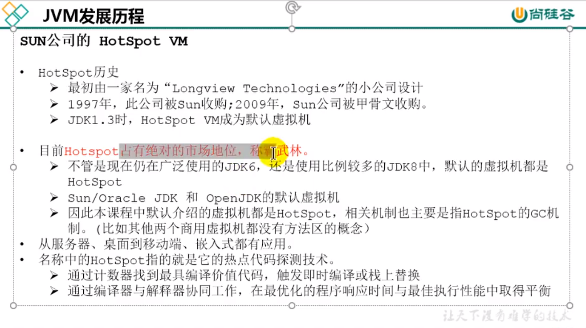

	